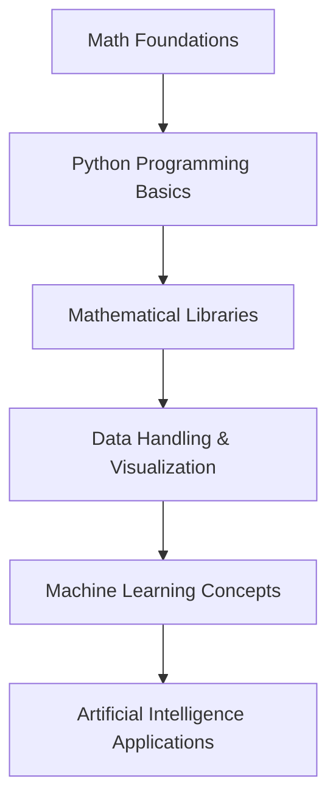

# IIUI-Python-For-Mathematics---Oct-25

# Python for Mathematics — IIUI Seminar (Oct 25)
> **Delivered by:** [Aaaina Batool](https://github.com/aainabatool)
> **Audience:** BS Mathematics Students, International Islamic University, Islamabad
> **Goal:** Inspire mathematicians to explore programming, data science, and artificial intelligence using Python.

---

##  Seminar Overview
This seminar bridges the gap between **pure mathematics** and **modern artificial intelligence (AI)**.
Students will learn how their mathematical knowledge — algebra, calculus, statistics, and graphs — powers the intelligence behind today’s AI systems.
Through interactive examples and Python demos, we’ll explore how mathematics **comes alive** through code.

---

##  Topics Covered

| Section                                       | Description                                                                                                                               | Tools Used                                               |
| --------------------------------------------- | ----------------------------------------------------------------------------------------------------------------------------------------- | -------------------------------------------------------- |
| **1. Introduction to Python**                 | Basics of variables, lists, loops, and logic for beginners with no programming background.                                                | `Python`, `Google Colab`                                 |
| **2. Mathematical Libraries in Python**       | Explore how NumPy, Pandas, Matplotlib, SymPy, and Scikit-learn help in solving mathematical and AI problems.                              | `NumPy`, `Pandas`, `Matplotlib`, `SymPy`, `Scikit-learn` |
| **3. Practical Mathematical Implementations** | Apply math concepts to real-world computations — solving linear equations, plotting graphs, performing regression, and matrix operations. | `NumPy`, `Matplotlib`, `SymPy`                           |
| **4. Image Processing and AI Preview**        | Demonstration of how mathematics powers computer vision and data science.                                                                 | `OpenCV`, `NumPy`                                        |
| **5. Python for Mathematics Slides**          | Conceptual slides summarizing the learning roadmap from Mathematics → Programming → AI.                                                   | `PDF` presentation                                       |

---

##  Learning Flow
### Step 1 → Understand Python Fundamentals
Simple syntax, lists, dictionaries, and loops.
### Step 2 → Explore Mathematical Libraries
Use Python to perform symbolic algebra, matrix manipulation, and plotting.
### Step 3 → Apply to Mathematical Problems
Solve problems from linear algebra, calculus, and graph theory using Python.
### Step 4 → Connect to AI and Data Science
See how your math powers machine learning — regression, prediction, and optimization.

---

## 📘 Files Description

| File                                | Description                                                                                 |
| ----------------------------------- | ------------------------------------------------------------------------------------------- |
| `Intro_Python.ipynb`                | A beginner-friendly introduction to Python (variables, lists, loops).                       |
| `Math_Libraries.ipynb`              | Overview of mathematical libraries like NumPy, Pandas, Matplotlib, SymPy, and Scikit-learn. |
| `Practical_Implementation.ipynb`    | Hands-on examples solving math problems (graphs, linear algebra, regression).               |
| `Image Processing.ipynb`            | Basic computer vision example to show how math applies to real-world image data.            |
| `Python for Mathematics-Slides.pdf` | Slides used during the seminar presentation.                                                |
| `README.md`                         | You’re reading it now! A complete overview of the repository and seminar.                   |

---

##  Learning Roadmap: From Mathematics to Artificial Intelligence

---

##  Example Topics Demonstrated

* Solving systems of linear equations using `SymPy`
* Matrix operations and eigenvalues using `NumPy`
* Data visualization with `Matplotlib`
* Linear regression using `Scikit-learn`
* Graph plotting and analysis
* Image matrix representation (Computer Vision glimpse)

---

##  How to Run the Notebooks

1. Open [Google Colab](https://colab.research.google.com/)
2. Upload any `.ipynb` file from this repo
3. Click **Runtime → Run All**
4. Modify code snippets to experiment and learn interactively

---

##  Closing Message

> Mathematics is not just the language of the universe —
> it’s the language of intelligence.
>
> As mathematicians, you already think in patterns, logic, and structures —
> the same building blocks that power every AI system today.
>
> Learn Python, and you’ll discover that programming is simply **mathematics in motion.**

---

##  Connect with Me

If you attended the seminar or are exploring this repo later, feel free to connect or share your learning journey:

* **GitHub:** [@aainabatool](https://github.com/aainabatool)
* **LinkedIn:** [Aaaina Batool](https://www.linkedin.com/in/aainabatool/)
* **Email:** [aainabatool@example.com](mailto:aainabatool@example.com) *(replace with yours if you want)*

